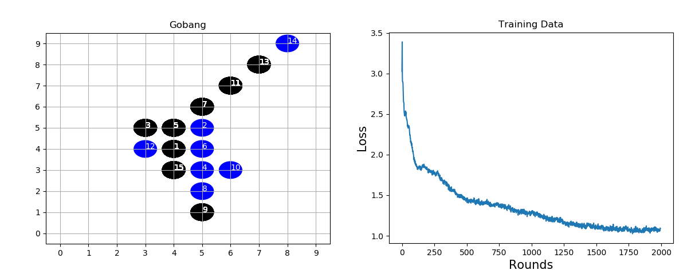

# Gobang


# OverView
Gobang(Five in a Row) reinforcement learning by [AlphaZero](https://deepmind.com/research/publications/mastering-game-go-without-human-knowledge) methods.
This project is based on these resources:
1. [junxiaosong/AlphaZero_Gomoku](https://github.com/junxiaosong/AlphaZero_Gomoku)
2. [AppliedDataSciencePartners/DeepReinforcementLearning](https://github.com/AppliedDataSciencePartners/DeepReinforcementLearning)

# Installation Dependencies
* Python3 (my own 3.7.3)
* tensorflow (my own 1.14.0)
* Keras (my own 2.1.6)
* matplotlib (GUI)(my own 3.1.1)

# How to Run
* Train 
```
python train.py 1
```
* Play with AI
```
python train.py 0
```
